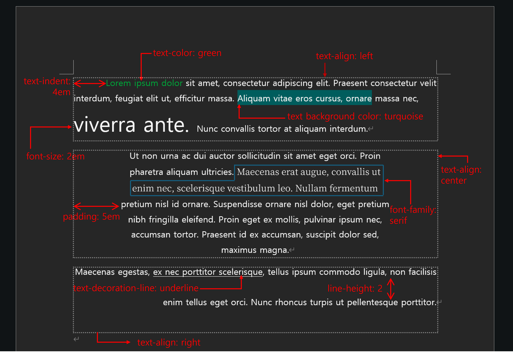

# Multimodal Writing with HTML
This is the guide to make a multimodal writing with HTML.


## What is HTML?
HTML is an abbreviation of HyperText Markup Language. It is the basic structure to build a web page.

### Structure of HTML
HTML uses **tag** to struct the content.
**tag** is something that looks like `<html>`.

You just *opened* the `<html>` tag. 
If you use a tag, you always need to *close* it with: `</html>`.

The closing tag always has `/` before the tag name.

**You cannot make a random tag!**
You need to use the right tag name for HTML.
These are the tags you will probably see in the future.
|Tag Name|Description|
|--------|-----------|
|`<html>`|You tell the machine this is an HTML document.|
|`<head>`| The head of the HTML document. It can include meta-data of the document, stuffs that are shown in your browser tab, or any other information of the document.|
|`<body>`| The body of the HTML document. What you actually see in the browser!|
|--------|Tags inside  `<head>`|
|`<title>`| The text you see in your browser tab|
|--------|Tags inside  `<body`|
|`<div>`| The *division* of the document.|
|`<h1>`~`<h6>`| The header of the document. Good for titles and subtitles!|
|``|The image you will put in the document.|
|`<audio>`|The audio you will put in the document.|
|`<video>`|The video you will put in the document.|
|`<a>`|The link to another document|

You can find more tags here at [W3 schools](https://www.w3schools.com/tags/ref_byfunc.asp).
You can also make tables, lists, buttons, text input window, check boxes, drop-downs, etc with tags. 


This is how the basic HTML looks like.
```html
<html>
    <head>
        <title> My First HTML Page </title>
    </head>

    <body>
        <h1> My First HTML Page! </h1>
        <div> Yay! I made my first HTML document.</div>
    </body>
</html>
```
You can see `<html> </html>` tag, `<head> </head>` tag, and `<body> </body>` tag.
You can see the *head* and the *body* is *inside* **HTML**.
*Inside* the **head**, you can see *title*.
*Inside* the **body**, you can see *h1* and *div*.

Consider each tag as a box. We can put another boxes inside or outside of the box to create document hierarchy.

┌ `<html>`
├── `<head>`
├──── `<title>`
├────── My First HTML Page
├──── `</title>`
├── `</head>`
├── `<body>`
├──── `<h1>`
├────── My First HTML Page!
├──── `</h1>`
├──── `<div>`
├────── Yay! I made my first HTML document.
├──── `</div>`
├── `<body>`
└ `<html>`
We can now see that `head` and `body` is at the same hierarchy, and `title`, `h1`, and `div` at the same hierarchy!

We call this hierarchy **cascading**.

Now, we want to style these boxes.
We call this specific styling guide of HTML as **CSS (Cascading Style Sheet)**. 

### Style guide: Mapping to basic MS Word
CSS selects specific boxes and style them **and** the boxes inside them.

If you want the body to be *pink*, CSS will make the `body`, `h1`, and `div` *pink*.
But the box in the **inner side** has the **priority**.
If you want `h1` to be *purple*, CSS will make `h1` *purple*, and `body` and `div` still *pink*.



## JSON: Processing your writing machine-friendly

### Process by paragraph order

### Process by paragraph style

## Beyond text: links, images, videos, etc.

### PATH: How to guide the machine where your medium is at

### Linking multimedia to your HTML

---

## Bibliography