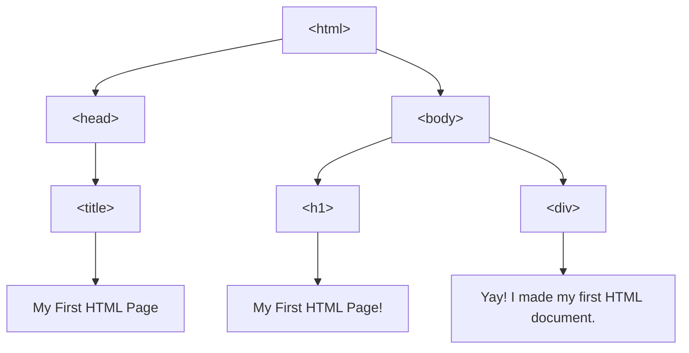
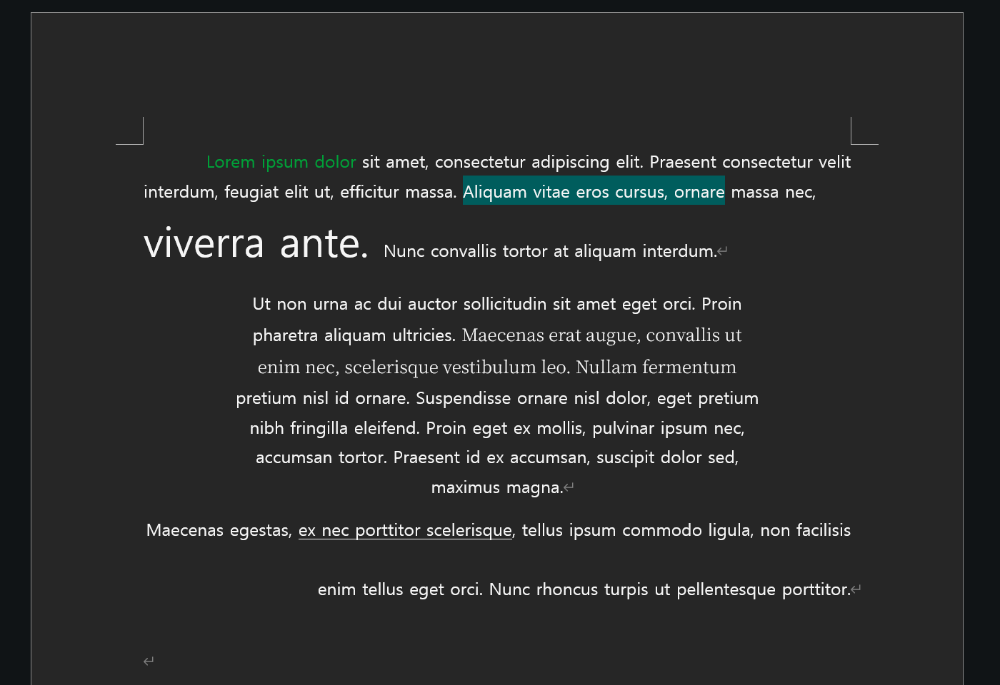

# Multimodal Writing with HTML
This is the guide to make a multimodal writing with HTML.


## What is HTML?
HTML is an abbreviation of HyperText Markup Language. It is the basic structure to build a web page.

- ### Structure of HTML
HTML uses **tag** to structure the content.
**tag** is something that looks like `<html>`.

You just *opened* the `<html>` tag. 
If you use a tag, you always need to *close* it with: `</html>`.

The closing tag always has `/` before the tag name.

**You cannot make a random tag!**
You need to use the right tag name for HTML.
These are the tags you will probably see in the future.
|Tag Name|Description|
|--------|-----------|
|`<html>`|You tell the machine this is an HTML document.|
|`<head>`| The head of the HTML document. It can include meta-data of the document, stuffs that are shown in your browser tab, or any other information of the document.|
|`<body>`| The body of the HTML document. What you actually see in the browser!|
|--------|Tags inside  `<head>`|
|`<title>`| The text you see in your browser tab|
|--------|Tags inside  `<body>`|
|`<div>`| The *division* of the document.|
|`<h1>`~`<h6>`| The header of the document. Good for titles and subtitles!|
|``|The image you will put in the document.|
|`<audio>`|The audio you will put in the document.|
|`<video>`|The video you will put in the document.|
|`<a>`|The link to another document|

You can find more tags here at [W3Schools](https://www.w3schools.com/tags/ref_byfunc.asp).
You can also make tables, lists, buttons, text input window, check boxes, drop-downs, etc with tags. 


This is how the basic HTML looks like.
```html
<html>
    <head>
        <title> My First HTML Page </title>
    </head>

    <body>
        <h1> My First HTML Page! </h1>
        <div> Yay! I made my first HTML document.</div>
    </body>
</html>
```
You can see `<html> </html>` tag, `<head> </head>` tag, and `<body> </body>` tag.
You can see the *head* and the *body* is *inside* **HTML**.
*Inside* the **head**, you can see *title*.
*Inside* the **body**, you can see *h1* and *div*.

Consider each tag as a box. We can put another boxes inside or outside of the box to create document hierarchy.


<table>
<tr>
<td>

```
┌ <html>
│   ├── <head>
│   │   ├── <title>
│   │   │   └── My First HTML Page
│   │   └── </title>
│   └── </head>
│   ├── <body>
│   │   ├── <h1>
│   │   │   └── My First HTML Page!
│   │   └── </h1>
│   │   ├── <div>
│   │   │   └── Yay! I made my first HTML document.
│   │   └── </div>
│   └── </body>
└ </html>
```

</td>
<td>



</td>
</tr>
</table>


We can now see that `head` and `body` is at the same hierarchy, and `title`, `h1`, and `div` at the same hierarchy!

Now, we want to style these boxes.
We call this specific styling guide of HTML as **CSS (Cascading Style Sheet)**. 


- ### Style guide: Mapping to basic MS Word
CSS selects specific boxes and style them **and** the boxes inside them.

If you want the body to be *pink*, CSS will make the `body`, `h1`, and `div` *pink*.
But the box in the **inner side** has **higher priority**.
If you want `h1` to be *purple*, CSS will make `h1` *purple*, and `body` and `div` still *pink*.

The grammar of CSS looks like this:
```css
body{
    background-color: pink;
}
h1{
    background-color: purple;
}
```
1. *Before* the braces, write the **tag name** you want to style.
2. *Inside* the braces, write the **styling property** and its **value**. 

You can play around with CSS's styling properties to see how the text changes. You can easily adjust your document like how you style your MS Word document!

I brought the example of an MS Word document here:


If you check each changed property here, there are:

<table>
<tr>
<td>


</td>
<td>

- [ ] text-indent
- [ ] text-color
- [ ] text-align
- [ ] text-background-color
- [ ] text-decoration-line
- [ ] font-family
- [ ] font-size
- [ ] padding
- [ ] line-height

</td>
</tr>
</table>


are the properties changed in this document. And these are the property names of CSS, too!

---

Let's consider each white dotted box as `<div>`. The CSS of this document should be something like:
``` CSS
    div1 {
        text-align: left;
        text-indent: 4em;
    }
    div2 {
        text-align: center;
        padding: 5em;
    }
    div3 {
        text-align: right;
        line-height: 2;
    }
```
Names like `div1`, `div2`, or `div3` will not work in your computer, since it is not the tag name. **However**, we are going to use AI to style them, and it is enough for the AI to notice where and how to style. 

+ You don't even need to write the correct property name in the AI! just write something like *text alignment: center*, and the AI will still do its work.
  + Try the promt like:
    ```
    (copy and paste the text content)
    I want to style this text in HTML.
    - paragraph 1:
        1. text indent is 4 times bigger than the character size.
        2. text align: left.
    - paragraph 2:
        1. text align: center.
        2. left and right padded with 5 character size blank.
    - paragraph 3:
        1. text align: right.
        2. line spacing/height: 2.0.

    Also, in paragraph 1,
    "Lorem ipsum dolor": I want it to be green.
    "Aliquam vitae eros cursus, ornare": turquoise background.
    "viverra ante": 2 times bigger than the default character size.

    in paragraph 2, 
    "Maecenas erat augue~... Nullam fermentum": serif font.

    in paragraph 3,
    "ex nec porttitor scelerisque": underline.
    ```

ChatGPT 5 (Plus plan) generated the HTML code in 15 seconds.
The generated code is in `gpt_generated.html`.

---
---

## Beyond text: links, images, videos, etc.
To make your writing truly multimodal, you might want to put links to other pages, images, audios or videos! HTML is one of the easiest way to work with them.
With `<a>`, ``, `<audio>` and `<video>` tags, we can add links, images, audios, and videos in our document!

- ### PATH: How to guide the machine where your medium is at
However, you need to tell the AI where that file is.

You might let AI to find their path, too...
But that means you are giving a permission to the AI company to surveil your computer usage inside and out.

You might not want that.

It's okay, it is easy:
1. ### If the content is in the internet: type in the **url**.
2. ### If the content is **NOT** in the internet:
   1. ### *Relative* path
        - Think from the **html file's view**. Where is the file located?
        - To tell the computer that the **file is in the same folder(directory)**, we use `.`.
        - If the **file is in the parent folder**, we use `..`.
        - And if **we are to divide folders and files**, we use `/`.
        ---
        -  Let's say we want to find `image.jpg` in the **same folder**.
           -  `image.jpg` or `./image.jpg`.
        -  What if it is **inside the `media` folder**?
           -  `./media/image.jpg`.
        -  If the `image.jpg` is **outside the folder**,
           -  you need to write `..`before the name.
           -  `../image.jpg`.
        -  If the `image.jpg` is **outside the folder of the outside of the html folder**:
           -  `../../image.jpg`. 
   ---
   2. ### *Absolute* path
        - Think from the computer's view. Where is the file located?
        - Usually, if you click the file with `Finder (Mac)` or `File Explorer (Windows)`, you will get a long address. They are from the root of your computer! You can access this file from anywhere in your computer. 
---
- #### ! Tips for less stressful file works
 1. File name that has space or character other than English, put quotation mark (`"`) around the path. `"image I like.jpg"`
      - Try to avoid using space! instead, use something like `-` or `_`. You can also use CapitalLetters.
      - The machine thinks `image.jpg` and `Image.jpg` as different things. Double check if you got the capital letters correct!
 2. If you are putting numbers in the media, try to use the same digit. ex: 01, 02, ... if your number ends with 2 digits. 001, 002,... if your number ends with 3 digits.

<br>

- ### Linking multimedia to your HTML
Write a prompt to AI with the correct path and it will generate a code for you!
However, if you want to write it by your own:
1. `<a>` tag uses `href`.
    `<a href="https://youtube.com"> Link to YouTube </a>`
    You will see "Link to YouTube" in the browser. This text will send you to YouTube.
2. `` tag uses `src`.
    ``
    You will see the image of `image.jpg` that is located in the same folder of where your html folder is at.
    **Note that `` does not close with `</img>`!**
3. `<audio>` and `<video>` tags use `<source>` tag inside.
    ```html
    <audio>
        <source src="song.mp3" type="audio/mpeg">
    </audio>
    ```
    You will see the audio play button that plays `song.mp3` that is located in the same folder of where your html folder is at.
    **Note that `<source>` does not close with `</source>`!**

---
---

## Bibliography